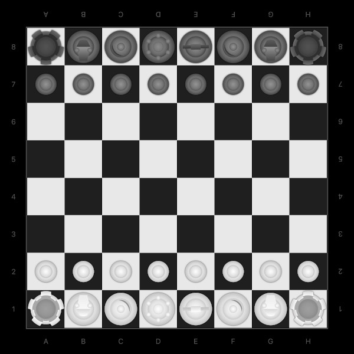

# Chess2D 
Шахматы для iPad с возможностью игры с компьютером и с человеком. 

### Дизайн
Дизайн фигур разработан для возможности настольной игры человека с человеком.

### Возможности приложения

- игра с человеком
- игра с компьютером
- выбор уровня сложности компьютера
- фиксация фигур в центре клетки
- замораживание фигур ожидающего игрока
- запрет на одновременное перемещение двух фигур
- проверка правильности ходов
- повышение пешки с возможностью выбора фигуры
- длинная и короткая рокировки 
- уведомление о мате и пате
- время текущего или последнего хода игроков
- общее время ходов каждого игрока

### Технические особенности
 - архитектура приложения – MVP (Model View Presenter).
 - игровой движок – [SwiftChess](https://github.com/SteveBarnegren/SwiftChess) (автор Steve Barnegren)

### Авторы
* [Зорькин Андрей](https://github.com/zooorkin)

### Лицензия
* Chess2D доступна по лицензии MIT. Смотрите файл [LICENSE](LICENSE).
